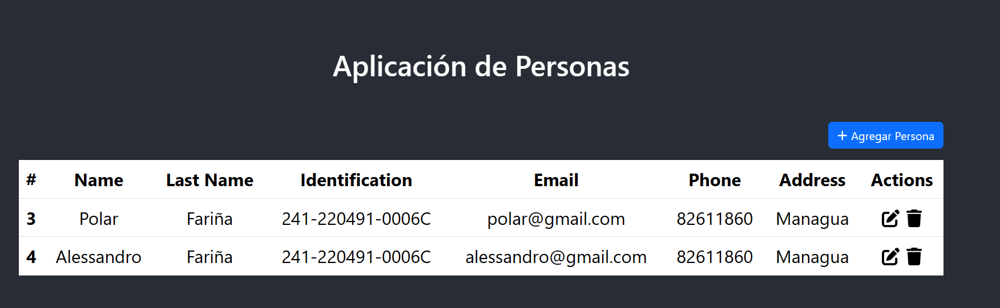

# Instrucciones para levantar el Frontend (CRUD PERSON)

Este proyecto frontend está construido con React y Node.js. Debemos seguir los siguientes pasos para levantar el frontend:

## 1. Instalación de Dependencias

Primeramente debemos tener Node.js versión 20 instalado en nuestro sistema. Podemos descargar la versión 20 de Node.js desde el sitio oficial de Node.js: [Descargas de Node.js.](https://nodejs.org/en/download/current)

## 2. Instrucciones de ejecución

Una vez que instalado Node.js 20, abrimos una terminal y navega hasta el directorio del proyecto:

```..\crud_person\crud_person```

Luego, ejecutamos el siguiente comando para instalar las dependencias del proyecto:

```npm install```

Este comando instalará todas las dependencias necesarias para el proyecto frontend.

### 2.1 Compilación del Proyecto

Una vez que se hayan instalado las dependencias, ejecutaremos el siguiente comando para compilar el proyecto:

```npm run build```

Este comando compilará el proyecto y generará los archivos estáticos necesarios para ejecutar la aplicación.

### 2.2 Iniciar la Aplicación

Una vez que se haya completado la compilación, ejecutaremos el siguiente comando para iniciar la aplicación:

```npm start```

Este comando iniciará la aplicación y podremos acceder a ella en desde el navegador en la dirección http://localhost:3000. Y se verá así:



